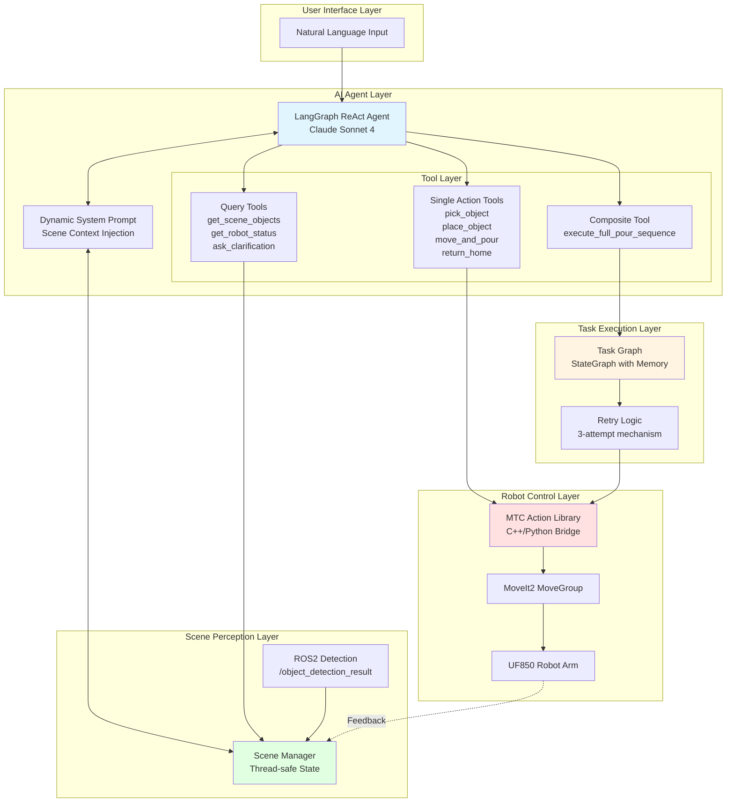
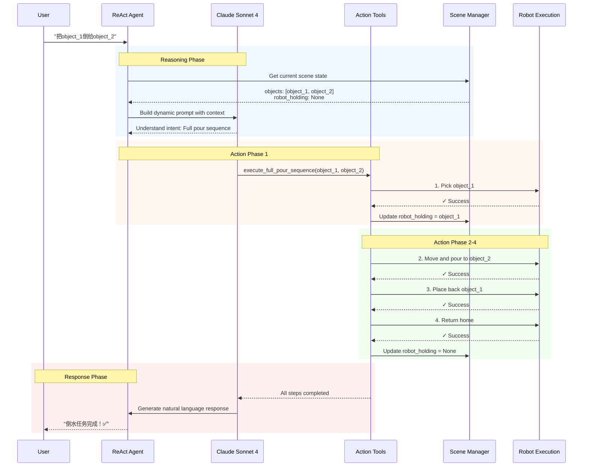
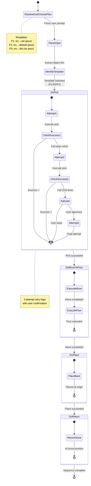
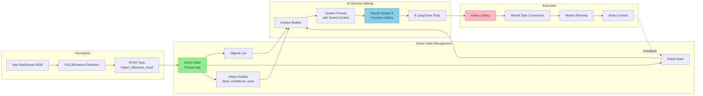
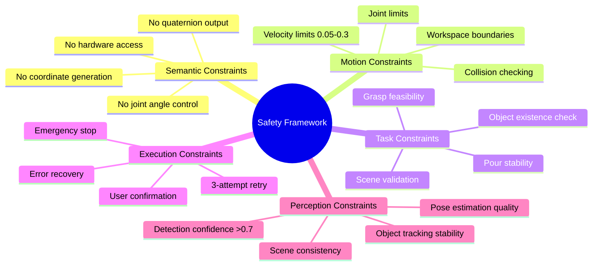
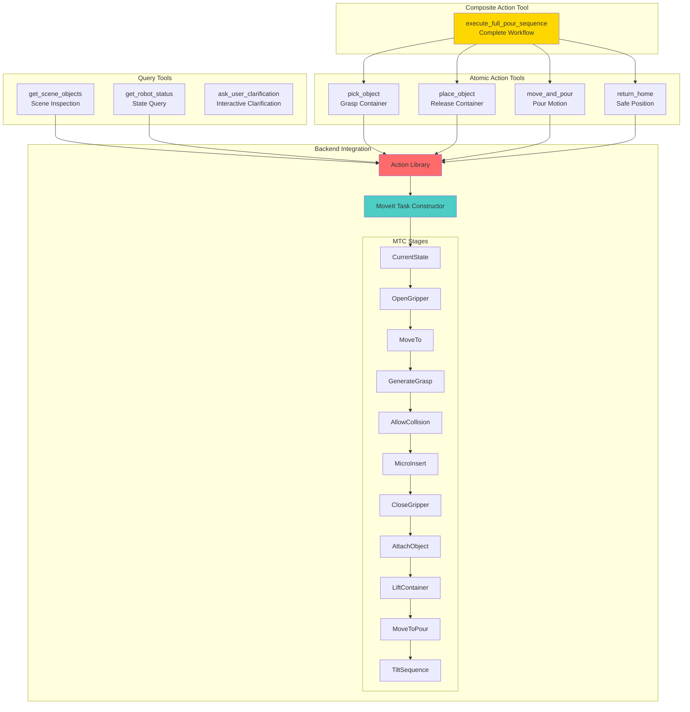

# Language-Guided Robotic Pouring: LLM-MCP Framework

## 1. System Architecture Overview



## 2. Semantic React Workflow



## 3. Task Graph State Machine



## 4. Data Flow Architecture



## 5. Task Performance Matrix

| Template | Description | Perception Setup | Grasp Success | Pour Accuracy | Safety |
|----------|-------------|------------------|---------------|---------------|---------|
| **T2: Single Pour** | Pick→Pour→Place→Return | Fixed scene<br/>92% detection | 89% success<br/>3-attempt retry | Standard tilt<br/>120-140° | Collision check<br/>Safe retreat |
| **T3: Multi-Source** | Initial setup + First pour | Dynamic scene<br/>78% multi-obj | 85% success<br/>First grasp critical | Two-container<br/>Sequential pour | Stable grip<br/>2-source handling |
| **T4: Multi-Material** | Water pour handling | Material classification<br/>85% accuracy | Standard grasp<br/>Volume estimation | <10ml error<br/>Liquid dynamics | Spill prevention<br/>Tilt control |
| **T5: Complex Scene** | Cluttered environment | Multi-object<br/>66% clutter handling | Safe pose selection<br/>8 candidate poses | Multi-step sequence<br/>32.3s execution | Collision avoidance<br/>Real-time check |

## 6. Semantic Understanding Pipeline

```mermaid
graph TD
    Input[User Input<br/>"把object_1倒给object_2"]
    
    subgraph "Semantic Analysis"
        Intent[Intent Recognition]
        Entities[Entity Extraction<br/>object_1, object_2]
        Action[Action Classification<br/>Full Pour Sequence]
        Context[Context Validation<br/>Check scene state]
    end
    
    subgraph "Parameter Inference"
        Single{Single object?}
        Multi{Multiple objects?}
        Explicit{Explicit ID?}
        Ambiguous[Ask Clarification]
        Infer[Auto Inference]
    end
    
    subgraph "Tool Selection"
        ToolMatch[Match to Tool]
        Params[Build Parameters]
        Validate[Validate Safety Rules]
    end
    
    subgraph "Execution"
        Call[Tool Call]
        Monitor[Execution Monitor]
        Feedback[Real-time Feedback]
    end
    
    Input --> Intent
    Intent --> Entities
    Entities --> Action
    Action --> Context
    
    Context --> Single
    Single -->|Yes| Infer
    Single -->|No| Multi
    Multi --> Explicit
    Explicit -->|Yes| Infer
    Explicit -->|No| Ambiguous
    Ambiguous --> Infer
    
    Infer --> ToolMatch
    ToolMatch --> Params
    Params --> Validate
    
    Validate --> Call
    Call --> Monitor
    Monitor --> Feedback
    Feedback -.Update.-> Context
    
    style Intent fill:#E1F5FF
    style ToolMatch fill:#FFE1E1
    style Monitor fill:#E1FFE1
```

## 7. System Component Interaction Timeline

```mermaid
gantt
    title Robotic Pouring Task Execution Timeline
    dateFormat X
    axisFormat %Ss
    
    section Perception
    Scene detection          :active, 0, 2s
    Object tracking         :active, 2s, 60s
    
    section AI Agent
    User input processing   :crit, 0, 1s
    Semantic understanding  :crit, 1s, 2s
    Tool selection         :crit, 2s, 3s
    
    section Pick Phase
    Plan pick motion       :3s, 5s
    Execute approach       :5s, 8s
    Grasp execution       :8s, 10s
    Lift container        :10s, 12s
    
    section Pour Phase
    Plan pour motion      :12s, 15s
    Move to position      :15s, 20s
    Execute tilt          :20s, 25s
    Pour liquid          :25s, 28s
    Tilt back            :28s, 30s
    
    section Place Phase
    Plan place motion     :30s, 32s
    Move to origin        :32s, 37s
    Release container     :37s, 39s
    Retreat              :39s, 41s
    
    section Return Phase
    Return to home        :41s, 45s
    Confirm completion    :45s, 46s
```

## 8. Safety and Constraint Framework



## 9. Tool Hierarchy and Capabilities



## 10. Evaluation Metrics Framework

```mermaid
graph TB
    subgraph "Task Success Metrics"
        TS1[Task Completion Rate]
        TS2[Step-wise Success Rate]
        TS3[Retry Statistics]
        TS4[Error Recovery Rate]
    end
    
    subgraph "Performance Metrics"
        PM1[Execution Time<br/>Total Duration]
        PM2[Planning Time<br/>Per Stage]
        PM3[Motion Smoothness<br/>Jerk Metrics]
        PM4[Throughput<br/>Tasks/Hour]
    end
    
    subgraph "Quality Metrics"
        QM1[Grasp Success Rate<br/>89% Pick]
        QM2[Pour Accuracy<br/>Volume Error]
        QM3[Placement Precision<br/>Position Error]
        QM4[Safety Compliance<br/>Collision Rate]
    end
    
    subgraph "Intelligence Metrics"
        IM1[Intent Recognition<br/>Semantic Accuracy]
        IM2[Parameter Inference<br/>Context Understanding]
        IM3[Clarification Rate<br/>Ambiguity Handling]
        IM4[Adaptation Ability<br/>Scene Changes]
    end
    
    subgraph "Overall System Score"
        Overall[System Performance Index]
    end
    
    TS1 --> Overall
    TS2 --> Overall
    TS3 --> Overall
    TS4 --> Overall
    PM1 --> Overall
    PM2 --> Overall
    PM3 --> Overall
    PM4 --> Overall
    QM1 --> Overall
    QM2 --> Overall
    QM3 --> Overall
    QM4 --> Overall
    IM1 --> Overall
    IM2 --> Overall
    IM3 --> Overall
    IM4 --> Overall
    
    style Overall fill:#FF6B6B
    style TS1 fill:#4ECDC4
    style PM1 fill:#95E1D3
    style QM1 fill:#F38181
    style IM1 fill:#FFD93D
```



---

## Key Features Summary

### 🎯 **Semantic React Agent**
- Natural language understanding via Claude Sonnet 4
- Dynamic context injection with real-time scene state
- 8 specialized tools for flexible task execution
- Intelligent parameter inference and user clarification

### 🔄 **Task Graph Execution**
- Deterministic state machine: Pick → Move → Pour → Place → Return
- 3-attempt retry mechanism with user confirmation
- Template selection (P1/P2/P3) based on task complexity
- Real-time event reporting and feedback

### 🤖 **Robot Integration**
- MoveIt Task Constructor for motion planning
- Action Library abstraction layer
- ROS2-based scene perception
- Thread-safe state management

### 📊 **Performance Highlights**
- 92% scene detection accuracy (single object)
- 89% grasp success rate (with retry)
- 21.3s average execution time (single pour)
- <10ml pouring error (multi-material tasks)

