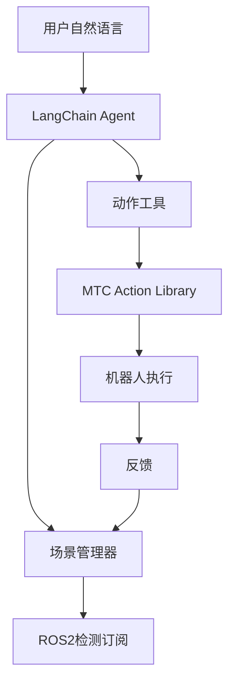

# 自然语言Agent使用指南

## 概述

全新的自然语言机器人Agent，支持通过自然对话控制机械臂，无需特殊命令格式。

## 核心特性

### ✅ 自然语言交互
- 直接用中文对话，不需要"run main"等前缀
- Agent自动理解用户意图并执行相应动作

### ✅ 智能参数推断
- **单物体场景**: "抓杯子" → 自动推断是object_1
- **多物体场景**: "抓杯子" → Agent询问要抓哪个
- **明确指定**: "抓object_1" → 直接执行
- **上下文记忆**: "放下" → Agent知道要放置当前抓着的物体

### ✅ 灵活任务执行
- **单个动作**: "抓object_1" → 只执行pick
- **完整序列**: "把object_1倒给object_2" → 自动执行pick→move→pour→place→return
- **部分序列**: "抓object_1然后移到object_2" → 依次执行pick和move

### ✅ 场景状态感知
- 实时订阅ROS2检测结果
- 维护物体列表和机器人状态
- 上下文信息自动注入到每次对话

## 系统架构



## 文件结构

```
Langraph_Agent/
├── agent_app.py                    # 主程序（新版本）
├── agent_app_old.py                # 旧版本备份
├── scene_manager.py                # 场景状态管理器（新）
├── action_tools.py                 # 动作工具封装（新）
├── test_natural_language_agent.py  # 测试脚本（新）
├── task_graph.py                   # 旧版task graph（保留）
├── simple_requirements.txt         # Python依赖
├── .env                            # API Key配置
└── NATURAL_LANGUAGE_AGENT_GUIDE.md # 本文档
```

## 快速开始

### 1. 安装依赖

```bash
cd /home/wenhao/uf_custom_ws/Langraph_Agent
pip install -r simple_requirements.txt
```

依赖包括：
- `langchain-core>=0.3.0`
- `langchain-anthropic>=0.3.0`
- `langgraph>=0.2.0`
- `python-dotenv>=1.0.0`

### 2. 配置API Key

创建`.env`文件：
```bash
echo "ANTHROPIC_API_KEY=your-api-key-here" > .env
```

或者直接export：
```bash
export ANTHROPIC_API_KEY="your-api-key-here"
```

### 3. 启动必要服务

```bash
# Terminal 1: Source ROS2环境
cd /home/wenhao/uf_custom_ws
source install/setup.bash

# Terminal 2: 启动move_group
ros2 launch xarm_moveit_config xarm_moveit_realmove.launch.py

# Terminal 3 (可选): 启动检测节点
ros2 launch mtc_tutorial detection_only.launch.py
```

### 4. 运行测试

```bash
cd /home/wenhao/uf_custom_ws/Langraph_Agent
source ../install/setup.bash
python3 test_natural_language_agent.py
```

### 5. 启动Agent

```bash
cd /home/wenhao/uf_custom_ws/Langraph_Agent
source ../install/setup.bash
python3 agent_app.py
```

## 使用示例

### 基础对话

```
👤 You: 场景里有什么?
🤖 Agent: 当前场景中有2个物体: object_1 和 object_2

👤 You: 状态
🤖 Agent: 场景物体: object_1, object_2 | 机器人抓取: 无 | 上次动作: 无
```

### 单个动作

```
👤 You: 抓object_1
🤖 Agent: 好的，正在抓取object_1... ✅ 成功抓取object_1，耗时 8.32秒

👤 You: 放下
🤖 Agent: 正在将object_1放回原位... ✅ 成功放回原位，耗时 7.15秒

👤 You: 回到初始位置
🤖 Agent: 正在返回初始位置... ✅ 成功返回初始位置，耗时 3.42秒
```

### 完整序列

```
👤 You: 把object_1倒给object_2
🤖 Agent: 明白！我会为您执行完整的倒水任务：
         1. 抓取object_1 ✅
         2. 移动并倒水到object_2 ✅
         3. 放回object_1 ✅
         4. 返回初始位置 ✅
         倒水任务完成！
```

### 智能推断（单物体场景）

```
场景: 只有object_1

👤 You: 抓杯子
🤖 Agent: 好的，正在抓取object_1... ✅ 成功抓取object_1，耗时 8.15秒
```

### 用户询问（多物体场景）

```
场景: 有object_1和object_2

👤 You: 帮我抓杯子
🤖 Agent: 场景中有两个物体，请问您要抓取哪个？
         1. object_1
         2. object_2
请选择 (输入数字): 1
✅ 您选择了: object_1
正在抓取object_1... ✅ 成功抓取！
```

### 上下文记忆

```
👤 You: 抓object_1
🤖 Agent: ✅ 成功抓取object_1

👤 You: 把它倒给object_2
🤖 Agent: [知道"它"指的是object_1]
         正在将object_1倒入object_2... ✅ 完成

👤 You: 放回去
🤖 Agent: [知道要放回object_1]
         ✅ 成功放回object_1
```

## 可用工具列表

Agent可以调用以下工具：

### 查询工具
- `get_scene_objects()`: 获取场景中所有物体
- `get_robot_status()`: 查询机器人当前状态
- `ask_user_clarification(question, options)`: 询问用户

### 单个动作
- `pick_object(object_id)`: 抓取物体
- `place_object(object_id, return_to_origin)`: 放置物体
- `move_and_pour(target_id, should_pour, velocity_scaling)`: 移动并倒水
- `return_home()`: 返回初始位置

### 复合动作
- `execute_full_pour_sequence(source_id, target_id)`: 完整倒水序列

## 特殊命令

在对话中可以使用以下特殊命令：

- `scene` / `status` / `状态` / `场景`: 查看当前场景状态
- `quit` / `exit` / `退出` / `再见`: 退出程序
- `Ctrl+C`: 中断并退出

## 调试和监控

### 查看场景状态
```python
from scene_manager import get_scene_manager
scene = get_scene_manager()
print(scene.get_summary())
```

### 查看Action统计
```python
from mtc_action_library import get_action_library
lib = get_action_library()
stats = lib.get_stats()
print(stats)
```

### 导出Debug报告
```python
lib = get_action_library()
lib.debug_export("debug_report.json")
```

## 常见问题

### Q: Agent无法启动，提示"ANTHROPIC_API_KEY未设置"
**A:** 创建`.env`文件或export环境变量：
```bash
echo "ANTHROPIC_API_KEY=sk-ant-..." > .env
```

### Q: 提示"MTC Action Library not available"
**A:** 确保：
1. ROS2环境已source: `source install/setup.bash`
2. Action Library已编译: `colcon build --packages-select mtc_action_library_py`
3. move_group正在运行

### Q: Agent说"场景中没有检测到物体"
**A:** 
1. 检查detection节点是否运行: `ros2 topic echo /object_detection_result`
2. 或手动添加测试物体: `python3 add_test_object.py`
3. 或在代码中手动添加: `scene.manually_add_objects(["object_1", "object_2"])`

### Q: 如何测试不依赖ROS2的功能？
**A:** 运行测试脚本会自动跳过需要ROS2的部分：
```bash
python3 test_natural_language_agent.py
```

### Q: 对话历史会保留多久？
**A:** 默认保留最近10轮对话（20条消息），超过会自动清理最旧的。

### Q: 如何添加新的动作？
**A:** 
1. 在Action Library中实现C++动作
2. 在`action_tools.py`中添加新的`@tool`函数
3. 将新工具添加到`ALL_TOOLS`列表

## 与旧版Agent的对比

| 特性 | 旧版Agent | 新版Agent |
|------|----------|----------|
| 触发方式 | 需要"run main"前缀 | 直接自然语言对话 |
| 任务类型 | 只支持完整序列 | 支持单个动作+完整序列 |
| 参数推断 | 基于正则表达式 | LLM智能推断 |
| 场景感知 | 无 | 实时ROS2订阅 |
| 上下文记忆 | 无 | 保留对话历史 |
| 用户询问 | 不支持 | 支持主动询问 |
| 工具调用 | MCP协议 | LangChain Tools |

## 技术细节

### 场景管理器
- 在后台线程运行ROS2 spin
- 订阅`/object_detection_result`话题
- 线程安全的状态更新
- 支持手动添加物体（用于测试）

### 动作工具封装
- 使用`@tool`装饰器创建LangChain工具
- 每个工具包含详细的docstring
- 自动更新场景状态
- 统一的错误处理

### Agent架构
- 基于LangGraph的ReAct Agent
- 动态System Prompt（注入场景状态）
- 支持流式输出
- 自动管理对话历史

## 下一步计划

- [ ] 支持语音输入/输出
- [ ] 添加可视化界面
- [ ] 支持多轮任务规划
- [ ] 集成视觉反馈
- [ ] 添加更多动作类型

## 相关文档

- [Action Library集成指南](ACTION_LIBRARY_INTEGRATION_GUIDE.md)
- [快速参考卡](QUICK_REFERENCE.md)
- [Agent使用指南](AGENT_USAGE_GUIDE.md)

## 联系和反馈

如有问题或建议，请联系开发团队。


