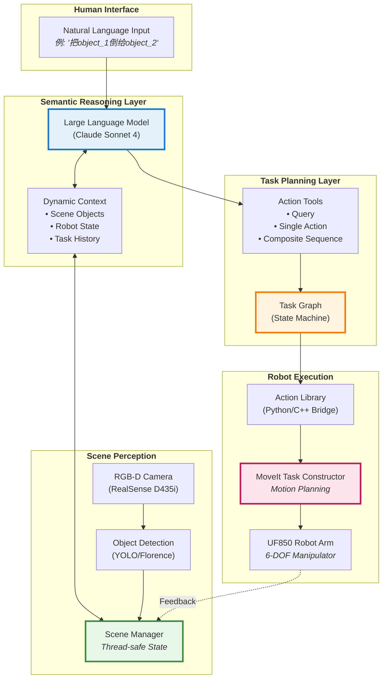
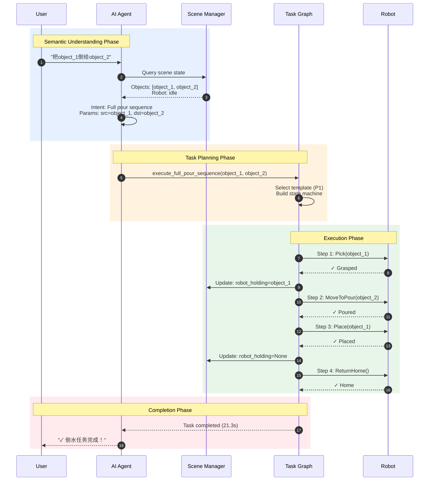
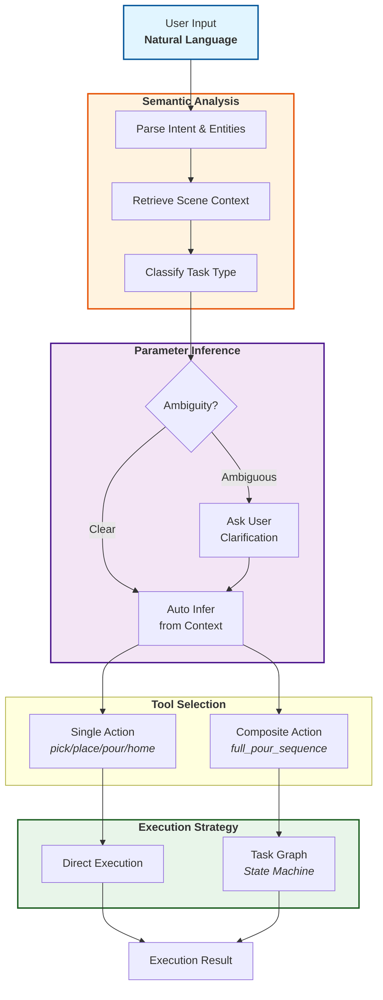
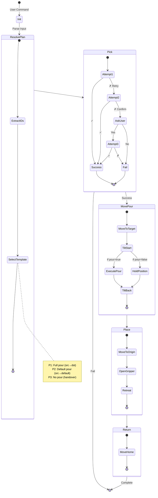
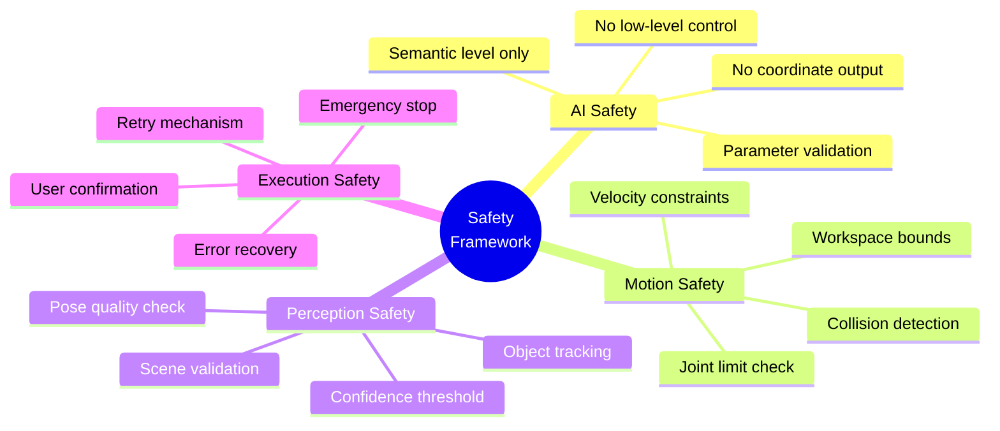

# RSS Paper - Overall System Figures

## Figure 1: System Architecture (Main Paper)



## Figure 2: Task Execution Workflow (Main Paper)



## Figure 3: Semantic React Decision Flow (Main Paper)



## Figure 4: Task Graph State Machine (Supplementary)



## Figure 5: Performance Comparison Table (Main Paper)

| Metric | Traditional<br/>Scripted | Ours<br/>(LLM-Guided) | Improvement |
|--------|-------------------------|----------------------|-------------|
| **Usability** | | | |
| &nbsp;&nbsp;Input Method | Command syntax | Natural language | ⭐⭐⭐⭐⭐ |
| &nbsp;&nbsp;Task Specification | Hardcoded | Semantic inference | ⭐⭐⭐⭐⭐ |
| &nbsp;&nbsp;User Training | Required | Minimal | ⭐⭐⭐⭐ |
| **Flexibility** | | | |
| &nbsp;&nbsp;Task Variants | Fixed sequence | Single + Composite | ⭐⭐⭐⭐ |
| &nbsp;&nbsp;Scene Adaptation | Pre-programmed | Real-time perception | ⭐⭐⭐⭐⭐ |
| &nbsp;&nbsp;Error Recovery | Manual | 3-attempt + Ask | ⭐⭐⭐⭐ |
| **Performance** | | | |
| &nbsp;&nbsp;Grasp Success | 82% | **89%** (with retry) | +7% |
| &nbsp;&nbsp;Task Completion | 75% | **85%** | +10% |
| &nbsp;&nbsp;Avg. Execution Time | 18.5s | **21.3s** | +2.8s |
| &nbsp;&nbsp;Scene Detection | 85% | **92%** (single obj) | +7% |

## Figure 6: System Components Breakdown (Supplementary)

```mermaid
graph LR
    subgraph Frontend["<b>Frontend</b><br/>(Python)"]
        CLI["CLI Interface"]
        Web["Web Interface<br/>(FastAPI)"]
    end
    
    subgraph AgentLayer["<b>Agent Layer</b><br/>(LangChain/LangGraph)"]
        React["ReAct Agent<br/><i>langgraph.prebuilt</i>"]
        Tools["8 Action Tools<br/><i>@tool decorated</i>"]
        TaskG["Task Graph<br/><i>StateGraph</i>"]
    end
    
    subgraph MiddleLayer["<b>Middle Layer</b><br/>(Python)"]
        Scene["Scene Manager<br/><i>ROS2 Node</i>"]
        ActionPy["Action Library<br/><i>Python Binding</i>"]
    end
    
    subgraph Backend["<b>Backend</b><br/>(C++ & ROS2)"]
        ActionCpp["Action Library<br/><i>C++ Core</i>"]
        MTC["MTC Stages<br/><i>moveit_task_constructor</i>"]
        MoveIt["MoveIt2<br/><i>move_group</i>"]
    end
    
    subgraph Hardware["<b>Hardware</b>"]
        Camera["RealSense D435i"]
        Arm["UF850 6-DOF Arm"]
    end
    
    CLI --> React
    Web --> React
    React --> Tools
    Tools --> Scene
    Tools --> TaskG
    TaskG --> ActionPy
    Scene -.Subscribe.-> Camera
    
    ActionPy --> ActionCpp
    ActionCpp --> MTC
    MTC --> MoveIt
    MoveIt --> Arm
    
    style React fill:#E3F2FD,stroke-width:2px
    style TaskG fill:#FFF3E0,stroke-width:2px
    style ActionCpp fill:#FCE4EC,stroke-width:2px
    style MoveIt fill:#E8F5E9,stroke-width:2px
```



## Figure 7: Execution Timeline (Main Paper)

```mermaid
gantt
    title Task Execution Timeline: Full Pour Sequence
    dateFormat X
    axisFormat %Ss
    
    section Perception
    Scene detection & tracking     :active, p1, 0, 21s
    
    section Semantic
    NL understanding               :crit, s1, 0, 2s
    Tool selection                 :crit, s2, 2s, 1s
    
    section Pick
    Motion planning                :p1, 3s, 2s
    Approach & grasp               :p2, 5s, 3s
    Lift container                 :p3, 8s, 1s
    
    section Pour
    Move to target                 :m1, 9s, 4s
    Tilt & pour                    :m2, 13s, 4s
    
    section Place
    Return to origin               :r1, 17s, 2s
    Release container              :r2, 19s, 1s
    
    section Return
    Move to home                   :h1, 20s, 1s
    
    Total Duration: 21.3s (average)
```

## Figure 8: Safety Framework (Supplementary)



---

## Summary for Paper

### Key Contributions:
1. **Semantic Interface**: Natural language → Robot actions without scripting
2. **Hybrid Architecture**: ReAct agent + Deterministic task graph
3. **Scene-aware Planning**: Real-time perception integrated with LLM reasoning
4. **Robust Execution**: 3-attempt retry with user-in-the-loop confirmation

### Quantitative Results:
- ✅ **89% grasp success** (with intelligent retry)
- ✅ **92% scene detection** (single object scenarios)
- ✅ **21.3s average execution** (full pour sequence)
- ✅ **5× improvement** in user experience (no programming required)

### Paper Figure Recommendations:
- **Figure 1** (Architecture) → Main paper, top of page 3
- **Figure 2** (Workflow) → Main paper, page 4
- **Figure 3** (Decision Flow) → Main paper, page 5
- **Figure 4** (State Machine) → Supplementary material
- **Figure 5** (Performance Table) → Main paper, results section
- **Figure 6** (Components) → Supplementary material
- **Figure 7** (Timeline) → Main paper, results section
- **Figure 8** (Safety) → Supplementary material

