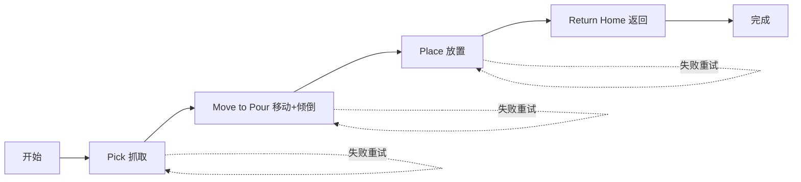

# LangGraph Agent - 基于 Action Library 的机器人控制

基于 LangGraph、Claude 和嵌入式 MTC Action Library 的机器人操作 AI Agent。

## 🎉 新功能：自然语言交互（2025-12-28）

**全新的自然语言Agent已上线！** 无需特殊命令格式，直接用自然语言对话控制机器人。

### ✨ 核心特性

- 🗣️ **自然对话**: 直接说"抓object_1"、"把object_1倒给object_2"，无需"run main"前缀
- 🧠 **智能推断**: 场景只有一个杯子时，说"抓杯子"自动推断；多个杯子时主动询问
- 🔄 **上下文记忆**: Agent记住抓着什么，说"放下"会自动放置当前物体
- 📊 **场景感知**: 实时订阅ROS2检测结果，了解场景中的物体
- 🎯 **灵活执行**: 支持单个动作（"抓取"）或完整序列（"倒水任务"）

### 🚀 快速开始（自然语言模式）

```bash
# 1. 安装依赖
cd Langraph_Agent
pip install -r simple_requirements.txt

# 2. 配置API Key
echo "ANTHROPIC_API_KEY=your-key" > .env

# 3. 启动Agent（推荐使用启动脚本）
./start_agent.sh

# 或手动启动
source ../install/setup.bash
python3 agent_app.py
```

### 💬 使用示例

```
👤 You: 场景里有什么?
🤖 Agent: 当前场景中有2个物体: object_1 和 object_2

👤 You: 抓object_1
🤖 Agent: 好的，正在抓取object_1... ✅ 成功抓取！

👤 You: 把它倒给object_2
🤖 Agent: 明白！正在执行倒水任务...
         1. 移动到object_2 ✅
         2. 倒水 ✅
         3. 放回object_1 ✅
         4. 返回初始位置 ✅
         任务完成！
```

### 📚 新增文档

- **[自然语言Agent使用指南](NATURAL_LANGUAGE_AGENT_GUIDE.md)** - 完整使用说明
- **[实施总结](IMPLEMENTATION_SUMMARY.md)** - 技术实现细节
- 运行 `python3 test_natural_language_agent.py` 查看所有测试场景

---

## 🎯 系统架构

### 直接调用模式（当前）
```
Agent → Python Action Library → C++ Core → MTC Task Builder → 机器人执行
```

**核心优势**：
- ⚡ **高性能**：直接 Python-C++ 调用，无网络开销
- 🔧 **易调试**：Python 堆栈直达 C++ 层
- 📦 **简洁**：移除 MCP 中间层，代码更直观
- 🎯 **类型安全**：直接使用 Python dataclass

## 📦 快速开始

### 1. 环境准备

```bash
# 确保已构建 Action Library
cd /home/wenhao/uf_custom_ws
colcon build --packages-select mtc_action_library_core mtc_action_library_py
source install/setup.bash
```

### 2. 安装 Python 依赖

```bash
cd Langraph_Agent
pip install -r simple_requirements.txt
```

### 3. 配置 API Key

```bash
# 设置 Anthropic API Key
export ANTHROPIC_API_KEY="your-anthropic-api-key"
```

### 4. 启动 Agent

**方式 1：命令行模式**
```bash
python3 agent_app.py
```

**方式 2：Web 界面模式**
```bash
bash start_simple.sh
# 然后在浏览器打开 simple_frontend.html
```

## 📁 文件说明

### 核心文件

- **`agent_app.py`**: Agent 主程序
  - 集成 Claude Sonnet 4 模型
  - 使用嵌入式 Action Library
  - 任务执行控制器

- **`task_graph.py`**: 任务图定义
  - 确定性任务流程：pick → move_to_pour → place → return_home
  - 状态管理和错误处理
  - 3次重试机制

### Web 界面（可选）

- **`simple_backend.py`**: FastAPI 后端服务
- **`simple_frontend.html`**: Web 控制界面
- **`start_simple.sh`**: 一键启动脚本

### 测试和文档

- **`test_action_library_integration.py`**: Action Library 集成测试
- **`ACTION_LIBRARY_INTEGRATION_GUIDE.md`**: 集成指南（详细说明）

## 🔧 可用动作

Action Library 提供以下动作：

### 1. pick(object_id, **params)
抓取容器
```python
result = lib.execute("pick", object_id="object")
```

### 2. move_to_pour(**params)
移动到倾倒位置并执行倾倒
```python
result = lib.execute("move_to_pour", 
    velocity_scaling=0.05,  # 慢速倾倒
    pour_execute=1.0
)
```

### 3. place(object_id, **params)
放置容器
```python
result = lib.execute("place", object_id="object")
```

### 4. return_home(**params)
返回初始位置
```python
result = lib.execute("return_home")
```

## 🎨 参数配置

所有动作支持丰富的参数配置（来自 mtc_tutorial）：

```python
# 使用默认参数
result = lib.execute("pick", object_id="object")

# 自定义参数
result = lib.execute(
    "pick",
    object_id="object",
    max_solutions=1,           # 只找1个解（快速模式）
    velocity_scaling=0.3,      # 速度缩放
    max_ik_solutions=2,        # IK解数量
    planner_timeout=3.0        # 规划超时
)
```

详细参数说明请参考：
- `../MTC_PARAMS_INTEGRATION_SUMMARY.md` - 参数集成总结
- `../MTC_ACTION_LIBRARY_PARAMETERS_GUIDE.md` - 完整参数指南

## 📊 任务流程



每个步骤最多重试 3 次，失败后进入错误恢复。

## 🐛 调试和故障排查

### 问题 1：Action Library 不可用

```bash
# 检查是否正确构建和 source
source /home/wenhao/uf_custom_ws/install/setup.bash
python3 -c "from mtc_action_library import get_action_library; print('✅ OK')"
```

### 问题 2：机器人不响应

```bash
# 1. 检查 move_group 是否运行
ros2 node list | grep move_group

# 2. 检查规划场景
ros2 topic echo /planning_scene --once

# 3. 使用诊断脚本
python3 ../diagnose_robot_env.py
```

### 问题 3：规划失败

可能原因：
- 目标对象不存在于场景中
- IK 求解失败
- 碰撞检测问题

解决方案：
```bash
# 添加测试对象到场景
python3 ../add_test_object.py

# 或调整参数
result = lib.execute("pick", 
    max_ik_solutions=5,        # 增加 IK 解数量
    planner_timeout=10.0       # 增加超时时间
)
```

## 🎓 示例代码

### 基础使用

```python
import rclpy
from mtc_action_library import get_action_library

rclpy.init()
lib = get_action_library()

# 执行单个动作
result = lib.execute("pick", object_id="object")
print(f"Pick 结果: {result}")
```

### 完整任务序列

```python
# 1. 快速抓取
pick_result = lib.execute("pick", velocity_scaling=0.4)

# 2. 慢速倾倒
pour_result = lib.execute("move_to_pour", velocity_scaling=0.05)

# 3. 精确放置
place_result = lib.execute("place", cartesian_step_size=0.005)

# 4. 快速返回
return_result = lib.execute("return_home", velocity_scaling=0.5)
```

### 在 Agent 中使用

参考 `task_graph.py` 中的实现，每个任务节点都是一个异步函数：

```python
async def do_pick(state: Dict[str, Any]) -> Dict[str, Any]:
    lib = get_action_library()
    result = lib.execute("pick", object_id="object")
    # 处理结果...
    return state
```

## 📚 相关文档

- [Action Library 集成指南](ACTION_LIBRARY_INTEGRATION_GUIDE.md) - 详细的集成说明
- [参数集成总结](../MTC_PARAMS_INTEGRATION_SUMMARY.md) - 参数配置完整指南
- [快速开始](../QUICK_START_ACTION_LIBRARY.md) - Action Library 快速入门
- [使用指南](../MTC_ACTION_LIBRARY_GUIDE.md) - 深入使用文档

## 🔑 安全提示

- ⚠️ **永远不要**将 API Key 提交到 Git 仓库
- 使用环境变量存储敏感信息
- 定期轮换 API Key

## 📝 许可证

TODO: 添加许可证信息

---

**最后更新**: 2025-12-28  
**版本**: Action Library v1.0 (移除 MCP 依赖)

